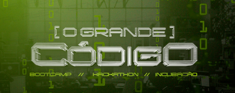

# 🚀 ZK Bootcamp




## 📚 Sobre o Bootcamp

O ZK Bootcamp é um programa intensivo de aprendizado focado em desenvolvimento de smart contracts e zero-knowledge proofs. Este bootcamp foi projetado para fornecer uma base sólida em desenvolvimento blockchain, com foco especial em segurança e boas práticas.

## 🎯 Objetivos

- Aprender fundamentos de desenvolvimento de smart contracts
- Entender conceitos de zero-knowledge proofs
- Desenvolver habilidades práticas em Solidity
- Implementar contratos seguros e otimizados
- Explorar ferramentas modernas de desenvolvimento

## 📋 Estrutura do Curso

### Semana 1: Fundamentos de Smart Contracts

#### [Aula 1: O Grande Código | Introdução à Web3: O Que é e Por Que Você Precisa Saber!](bootcamp/week1/lesson1/README.md)
- Configuração do ambiente de desenvolvimento
- Introdução à EVM e Solidity
- Primeiros passos com smart contracts
- Conceitos básicos de segurança

#### [Aula 2: O Grande Código | Seu primeiro projeto no ar usando solidity](bootcamp/week1/lesson2/README.md)
- Ferramentas do Foundry
- EVM & Solidity em profundidade
- Fundamentos de Solidity
- Segurança básica
- Implementação prática de um token ERC-20

## 🛠️ Tecnologias Utilizadas

- **Solidity**: Linguagem principal para desenvolvimento de smart contracts
- **Foundry**: Suíte de ferramentas para desenvolvimento
- **EVM**: Ethereum Virtual Machine
- **Git**: Controle de versão
- **VSCode**: IDE recomendada

## 📦 Pré-requisitos

- Conhecimento básico de programação
- Familiaridade com linha de comando
- Git instalado
- Node.js (opcional)
- VSCode ou outra IDE

## 🚀 Como Começar

1. Clone o repositório:
```bash
git clone https://github.com/seu-usuario/zk-bootcamp.git
cd zk-bootcamp
```

2. Instale as dependências:
```bash
# Instalar Foundry
curl -L https://foundry.paradigm.xyz | bash
foundryup
```

3. Siga as aulas em ordem:
   - [Aula 1](bootcamp/week1/lesson1/README.md)
   - [Aula 2](bootcamp/week1/lesson2/README.md)

## 📚 Recursos Adicionais

- [Documentação do Solidity](https://docs.soliditylang.org/)
- [Documentação do Foundry](https://book.getfoundry.sh/)
- [Ethereum Developer Documentation](https://ethereum.org/developers/)
- [OpenZeppelin Documentation](https://docs.openzeppelin.com/)

## 🤝 Contribuindo

Contribuições são bem-vindas! Por favor, leia nosso guia de contribuição antes de submeter pull requests.

## 📝 Licença

Este projeto está licenciado sob a licença MIT - veja o arquivo [LICENSE](LICENSE) para detalhes.

## 👥 Autores

- **Daniel R Gorgonha** - [LinkedIn](https://www.linkedin.com/in/danielgorgonha/)

---

Feito com 💜 by <a href="https://www.linkedin.com/in/danielgorgonha/">Daniel R Gorgonha</a> :wave:
