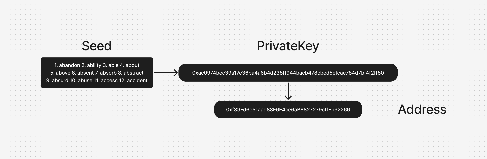
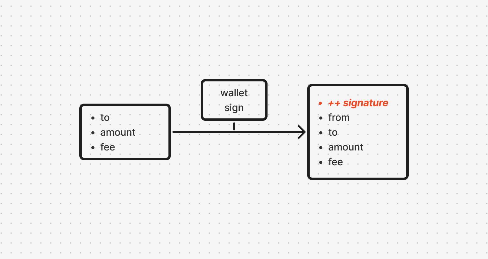
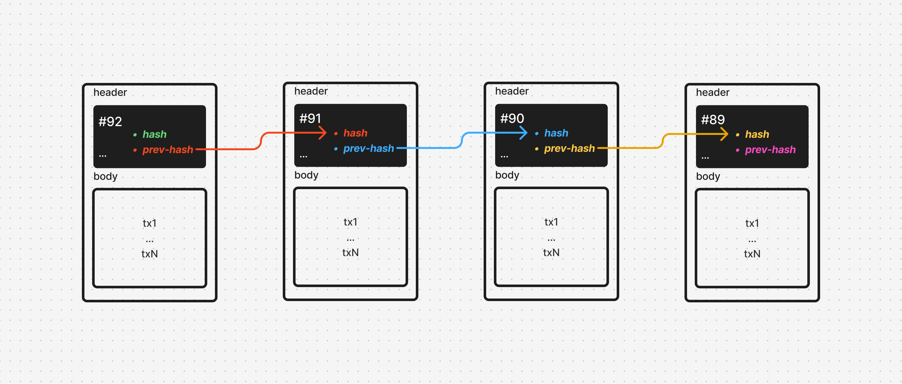
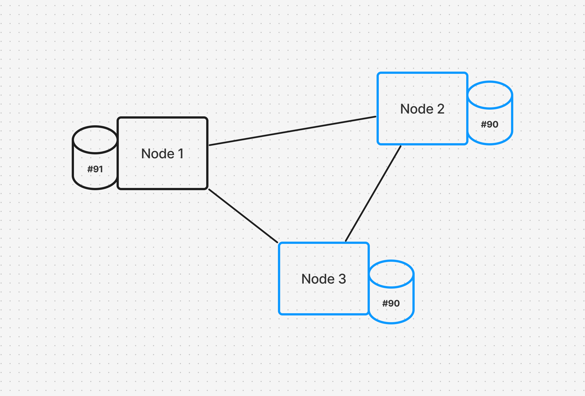
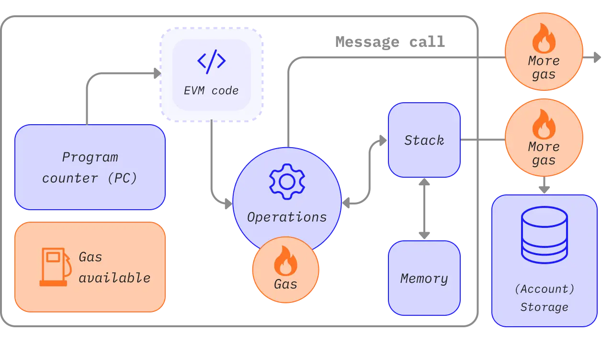
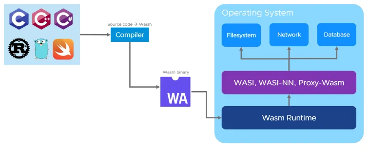

# Aula 1 - O Grande Código | Introdução à Web3: O Que é e Por Que Você Precisa Saber!

## ZkVerify
- Projeto focado em Zero-Knowledge Proofs (ZKPs).
- Casos de uso:
  - Verificação de identidade sem expor dados pessoais.
  - Transações privadas em blockchain.
  - Integração com DeFi e DAOs.

### Arquitetura ZkVerify (Zero-Knowledge Proof Verification)

A arquitetura **ZkVerify** (ou Zero-Knowledge Proofs Verification) é um conceito relacionado à verificação de provas de conhecimento zero, onde um provador (que tem informações secretas) pode convencer um verificador de que conhece algo, sem revelar diretamente o que sabe. Esse conceito é utilizado principalmente em criptografia e blockchain para garantir privacidade e segurança.

#### Componentes principais:

1. **Provador (Prover):**
   - O provador tem uma informação secreta (como uma senha ou um cálculo de um problema) e deseja provar ao verificador que tem essa informação, sem revelá-la de fato.
   
2. **Verificador (Verifier):**
   - O verificador deseja confirmar a autenticidade da informação apresentada pelo provador sem saber o conteúdo exato. 
   - O verificador solicita informações que ajudam a validar a prova, mas sem que o provador precise revelar o segredo.

3. **Zero-Knowledge Proof (Prova de Conhecimento Zero):**
   - O provador usa um protocolo matemático para gerar uma prova que é **válida** (ou seja, é verdadeira) e **sem conhecimento** (ou seja, não revela nada além da veracidade da afirmação).

#### Como funciona a arquitetura ZkVerify:

1. **Fase de Preparação (Setup):**
   - O provador e o verificador concordam com um conjunto de parâmetros comuns que serão usados na verificação da prova. Isso pode incluir a escolha de um sistema de criptografia adequado, como as funções de hash.
   
2. **Fase de Desafio e Resposta:**
   - O provador gera uma prova para uma determinada afirmação (ex: "Eu sei a solução para este problema").
   - O verificador gera um "desafio" aleatório (um tipo de pergunta) e o provador responde a ele de uma maneira que só faria sentido se ele soubesse a resposta secreta.
   - O desafio e a resposta são usados como inputs para a verificação da prova.
   
3. **Fase de Verificação:**
   - O verificador verifica a resposta do provador sem aprender nada sobre o segredo em si, mas apenas validando que a prova é verdadeira.
   - A prova é considerada válida se o provador não consegue produzir uma resposta correta ao desafio sem conhecer o segredo.

#### Tipos de Provas de Conhecimento Zero:
- **Prova interativa:** O provador e o verificador trocam várias mensagens até que a prova seja confirmada.
- **Prova não interativa (NIZK):** O provador envia uma única mensagem ao verificador que contém a prova completa, sem necessidade de interação contínua.

#### Aplicações:
- **Criptomoedas:** Em sistemas como o Zcash, Zero-Knowledge Proofs são usados para realizar transações privadas, onde ninguém pode ver os valores transferidos, mas todos podem verificar a validade da transação.
- **Autenticação sem senha:** Pode ser usado para sistemas de autenticação onde o usuário pode provar que conhece uma senha sem realmente precisar inseri-la.
- **Blockchain:** Em plataformas de contratos inteligentes, ZKPs são usados para melhorar a privacidade e a escalabilidade.

#### Exemplo de Arquitetura (em termos simples):

1. Provador -> "Eu sei a solução para o problema."
2. Verificador -> "Prove isso sem me mostrar a solução."
3. Provador gera uma resposta que depende da solução.
4. Verificador valida a resposta sem aprender a solução.
5. Prova é considerada válida ou inválida.

#### [ZkVerify Documentations](https://docs.zkverify.io/)
#### [ZkVerify GitHub](https://github.com/zkVerify/zkVerify/tree/main)

## Fundamentos
- Carteiras (Wallets)
- Transações
- Blocos
- Consenso

---

### Carteiras (Wallets)

---

### Transações

---

### Blocos

---

### Consenso

---

## **7. Smart Contracts**

- **EVM/Solidity**
- **Não-EVM (WASM/Rust)**

---

### EVM/Solidity

---

### Não-EVM (WASM/Rust)

---

Feito com 💜 by <a href="https://www.linkedin.com/in/danielgorgonha/">Daniel R Gorgonha</a> :wave: